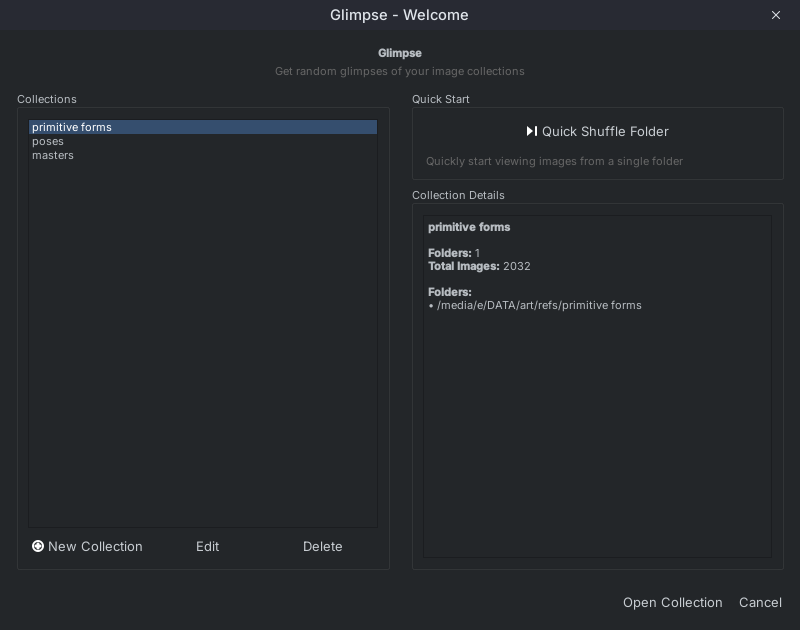
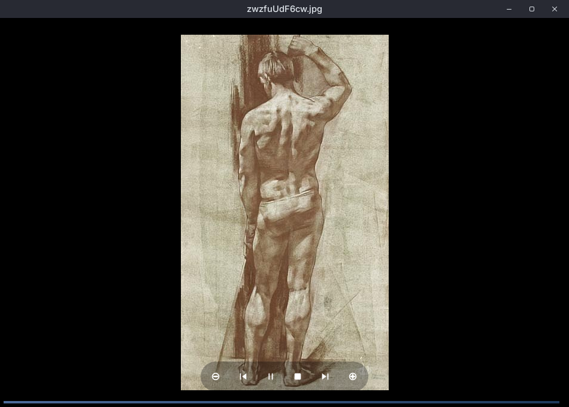
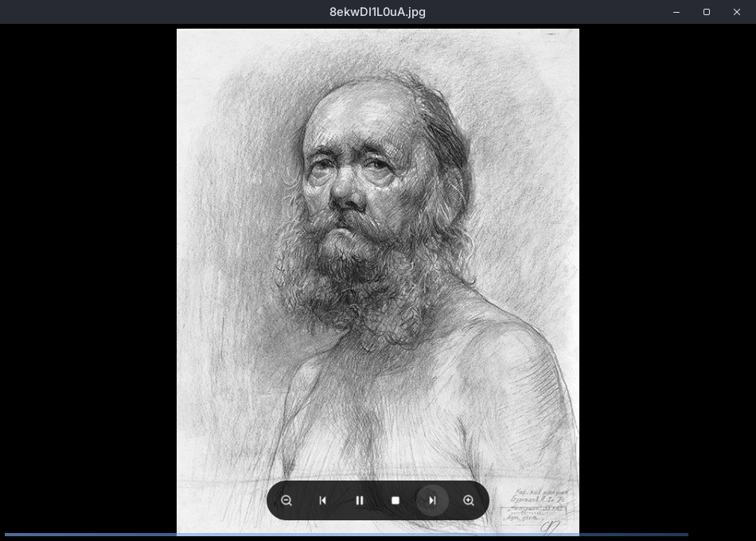
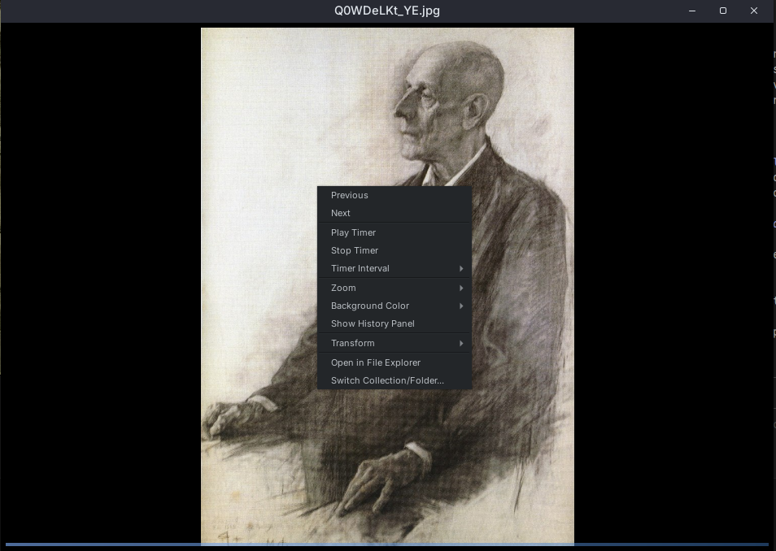

# Glimpse 👁️

**Random image viewer for collections**

A cross-platform desktop application for viewing random images from folders or collections. Useful for reference studies, browsing large image libraries, and rediscovering artwork.

## ✨ Features

### 🎲 **Collections & Random Viewing**
- Organize multiple folders into collections
- Quick shuffle mode for single folders
- History navigation with thumbnail panel

### ⏰ **Timer System** 
- Auto-advance with custom intervals (30 seconds to hours)
- Play/pause/stop controls
- Manual browsing mode

### 🖼️ **Image Viewing**
- Zoom and pan support
- Image transformations (flip, grayscale)
- Configurable backgrounds (black, gray, adaptive)

### 🎨 **Interface**
- Dark theme
- Keyboard shortcuts and right-click menu
- Minimal UI design

### 💾 **Collection Management**
- Multi-folder collections
- Persistent storage between sessions
- Cross-platform support (Windows, macOS, Linux)

---

## 🚀 Quick Start

### Installation

**Option 1: Run from Source**
```bash
# Clone the repository
git clone https://github.com/radioactiveorange/glimpse.git
cd glimpse

# Install dependencies with uv (recommended)
uv pip install pyside6

# Run the application
uv run main.py
```

**Option 2: Build Executable**
```bash
# Install PyInstaller
uv pip install pyinstaller

# Build standalone executable
pyinstaller --noconfirm --onefile --windowed --icon=app_icon.png main.py

# Find your executable in the dist/ folder
```

---

### First Launch

1. Create a collection by clicking "New Collection" and selecting folders
2. Configure timer settings (or disable for manual browsing)
3. Click "Open Collection" to start viewing

Alternatively, use "Quick Shuffle Folder" to browse any folder immediately.

---

## 🎯 Use Cases

- Reference image studies
- Portfolio reviews
- Browsing large image libraries
- Visual research and inspiration

---

## ⌨️ Keyboard Shortcuts

| Shortcut | Action |
|----------|--------|
| `←` `→` | Navigate previous/next image |
| `Ctrl` `+` | Zoom in |
| `Ctrl` `-` | Zoom out |
| `Ctrl` `0` | Reset zoom to 100% |
| `Right-click` | Open context menu |

## 🖱️ Mouse Controls

- **Left-click + Drag**: Pan image when zoomed
- **Mouse Wheel**: Zoom in/out
- **Right-click**: Context menu with all options

---

## 🛠️ Advanced Features

### Collection Management
- Edit collections (rename, manage folders)
- Delete collections
- Auto-sorted by recent usage

### Image Processing  
- Supported formats: JPG, JPEG, PNG, BMP, GIF
- Recursive search in subfolders
- Grayscale mode and flip controls

### Customization
- Background modes: Black, Gray, Adaptive Color
- Timer intervals: 30s, 1min, 2min, 5min, or custom
- Configurable history panel

## 🏗️ Technical Details

- Framework: PySide6 (Qt for Python)
- Modular architecture
- JSON-based collection storage
- Cross-platform settings and data directories
- Image caching for smooth performance

## 🎨 Screenshots

### Welcome Screen & Collections


### Main Interface


### Media Controls


### Context Menu


---

## 🤝 Contributing

This project was built collaboratively with Claude Code. Contributions, bug reports, and feature requests are welcome!

---

## 📝 License

This project is open source. License details to be added.

---

**Glimpse** - *Random glimpses of your visual world* ✨

*Built for artists, by artists (and AI) 🎨🤖*