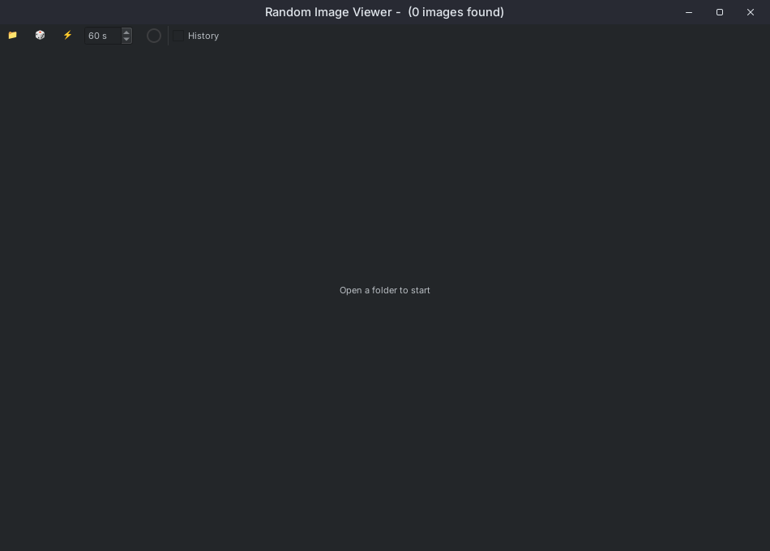
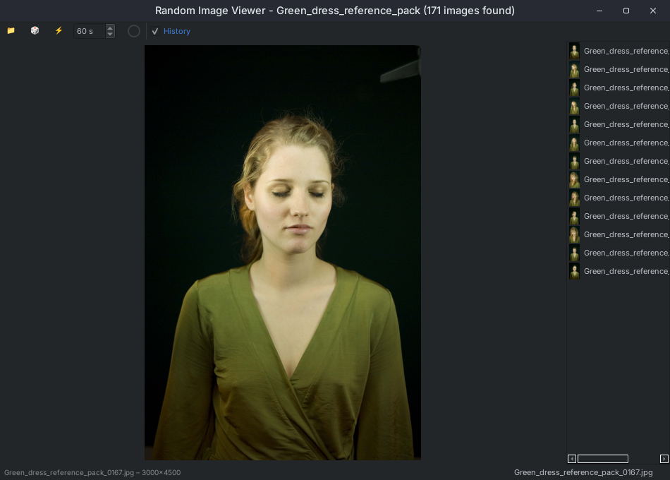
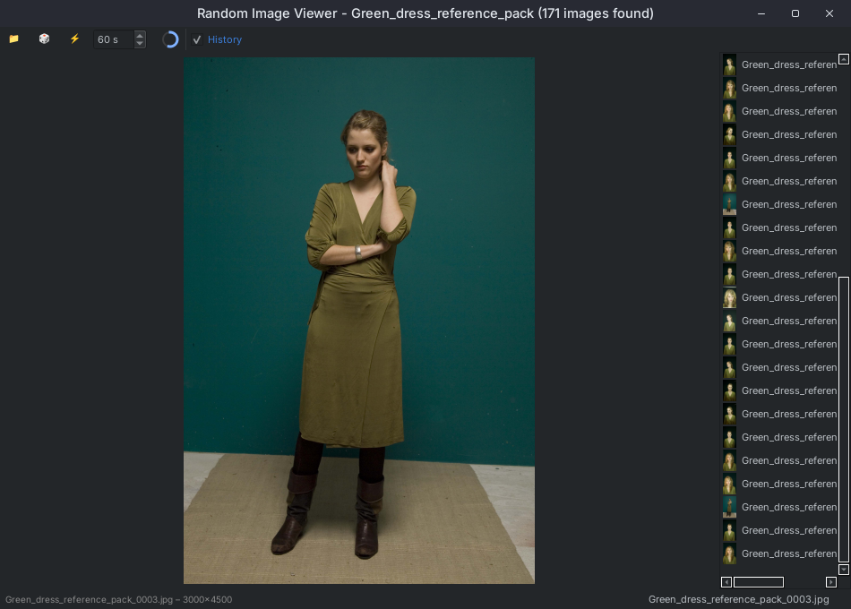

# Random Image Viewer

A simple, dark-themed, **cross-platform** desktop app to view random images from a folder or its subfolders, with history navigation, timer-based auto-advance, and more.
Built with [PySide6](https://doc.qt.io/qtforpython/).

> **I use this app for viewing reference photos for gesture drawing**—but it’s handy for any case where you want random image inspiration!

---

## Features

- 📁 **Open a Folder:** Browse and select a folder to load images (including subfolders).
- 🎲 **Random Image:** Show a random image, avoiding repeats until all images are viewed.
- ⏮️ ⏭️ **History Navigation:** Use arrow keys or the history panel to revisit previously viewed images.
- ⚡ **Auto-Advance:** Enable a timer to auto-advance to a new random image at set intervals.
- 🕒 **Pie Timer UI:** See a circular countdown while auto-advance is enabled.
- 🗂️ **Clickable Path:** Image path is shown in the status bar; click to open the folder in your file explorer.
- 🎲 **Fun Dice Icon:** Uses a dice emoji as the app icon for a playful touch!
- 🌑 **Dark Theme:** Modern, minimal dark UI.
- 🖥️ **Cross-platform:** Works on Windows, macOS, and Linux.

---

## Installation

1. **Clone this repo:**
    ```bash
    git clone https://github.com/YOUR_USERNAME/random-image-viewer.git
    cd random-image-viewer
    ```

2. **Install dependencies:**

    ```bash
    pip install PySide6
    ```

---

## How to Run

### Windows/macOS/Linux

- Open a terminal in the project folder.
- Run:
    ```bash
    python main.py
    ```

> **Note:** On some systems, you may need to use `python` instead of `python3` depending on how Python is installed.


### Using uv

- Open a terminal in the project folder.
- Run:
    ```bash
    uv run main.py
    ```

---

## Usage Instructions

1. **Open a Folder:**
   Click the 📁 button in the toolbar and select a folder containing images.

2. **Show Random Image:**
   Click the 🎲 button or simply press the **Right Arrow** key to get a new random image.

3. **Navigate History:**
   - Press **Left Arrow** to go to the previous image.
   - Press **Right Arrow** to go forward (or load a new random image at the end of history).
   - Enable the "History" checkbox to show a list of viewed images; click any to jump to it.

4. **Auto-Advance:**
   - Click the ⚡ button to enable automatic random image advance.
   - Adjust the interval (in seconds) with the spin box.
   - A circular timer will show the countdown.

5. **Image Info and Path:**
   - Info about the current image is shown in the status bar.
   - The image path is a clickable link; click to open the folder in your file explorer.

---

## Screenshots


*Main window with random image loaded*


*History panel enabled and showing viewed images*


*Toolbar with pie timer and auto-advance controls*

> **Tip:** If you want to add your own screenshots, just create a `screenshots/` folder and save PNG/JPG images there.

---

## Demo

**Typical gesture drawing workflow:**

```bash
# 1. Run the app
python main.py

# 2. Click 📁 and select your reference photo folder

# 3. Press → (right arrow) to see new random photos for fast gesture sketches

# 4. Use ← (left arrow) to go back if you missed a pose

# 5. Enable auto-advance with ⚡ for a timed gesture drawing session!
```

---

## Requirements

- Python 3.8+
- [PySide6](https://pypi.org/project/PySide6/)

---

## License

MIT License.

---

## Credits

- Uses [PySide6](https://doc.qt.io/qtforpython/) for the GUI.
- Dice emoji and icons are Unicode.
- Dark theme inspired by modern code editors.

---

**Enjoy your reference drawing sessions!**
