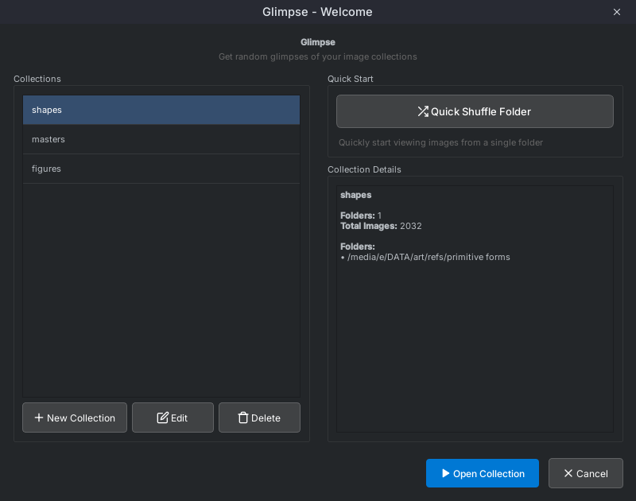
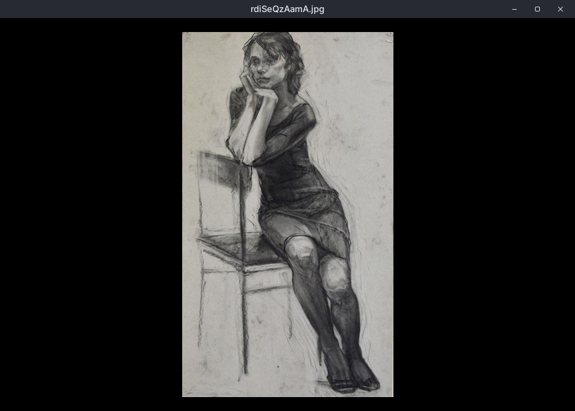

<p align="center">
  
</p>

# Glimpse 👁️

**Random image viewer for collections**

A cross-platform desktop application for viewing random images from folders or collections. Useful for reference studies, browsing large image libraries, and rediscovering artwork.

[](https://github.com/radioactiveorange/glimpse/releases/latest)
[](https://github.com/radioactiveorange/glimpse/releases)
[](https://www.gnu.org/licenses/gpl-3.0)

## 📋 Table of Contents

- [✨ Features](#-features)
- [📦 Installation](#-installation)
- [🚀 Quick Start](#-quick-start)
- [🎯 Use Cases](#-use-cases)
- [⌨️ Keyboard Shortcuts](#️-keyboard-shortcuts)
- [🖱️ Mouse Controls](#️-mouse-controls)
- [🛠️ Advanced Features](#️-advanced-features)
- [🏗️ Technical Details](#️-technical-details)
- [🎨 Screenshots](#-screenshots)
- [🙏 Inspiration](#-inspiration)
- [🤝 Contributing](#-contributing)
- [📝 License](#-license)

## ✨ Features

### 🎲 **Collections & Smart Sorting**
- Organize multiple folders into collections
- **Flexible sorting options**: Random (shuffle), Alphabetical (name), Full path, File size, Date modified
- **Ascending/descending order** for all sort methods except random
- Quick shuffle mode for single folders
- History navigation with thumbnail panel

### ⏰ **Timer System** 
- Auto-advance with custom intervals (30 seconds to hours)
- Play/pause/stop controls
- Manual browsing mode

### 🖼️ **Image Viewing**
- Zoom and pan support
- Image transformations (flip, grayscale)
- Configurable backgrounds (black, gray, adaptive)

### 🎨 **Interface**
- Dark theme
- Keyboard shortcuts and right-click menu
- Minimal UI design

### 💾 **Collection Management**
- Multi-folder collections with professional startup dialog
- Persistent storage between sessions
- Collection editing, deletion, and organization
- Quick folder location access
- Cross-platform support (Windows, macOS, Linux)

---

## 📦 Installation

### 🎯 Recommended: Download Pre-built Binaries

**[📥 Download Latest Release](https://github.com/radioactiveorange/glimpse/releases/latest)**

| Platform | File | Installation |
|----------|------|--------------|
| **Windows** | `glimpse-viewer-*.exe` | Download and run directly |
| **macOS** | `glimpse-viewer-*.dmg` | Download, mount, and drag to Applications |
| **Linux** | `glimpse-viewer-*.deb` | `sudo dpkg -i glimpse-viewer-*.deb` |
| **Linux** | `glimpse-viewer-*.tar.gz` | Extract and run `./glimpse` |

### 🛠️ Development Installation

**Prerequisites:**
- Python 3.13+
- [uv](https://docs.astral.sh/uv/) (fast Python package manager) - Install with: `pip install uv`

**Run from Source:**
```bash
# Clone the repository
git clone https://github.com/radioactiveorange/glimpse.git
cd glimpse

# Install dependencies and run (uv handles venv automatically)
uv pip install pyside6

# Run the application
uv run main.py
```

**Build Your Own Executable:**
```bash
# Install build dependencies
uv pip install pyinstaller pyside6

# Build standalone executable using the spec file
pyinstaller glimpse.spec

# Find your executable in the dist/ folder
```

---

## 🚀 Quick Start

1. Create a collection by clicking "New Collection" and selecting folders
2. Configure timer settings (or disable for manual browsing)
3. Click "Open Collection" to start viewing

Alternatively, use "Quick Shuffle Folder" to browse any folder immediately.

---

## 🎯 Use Cases

- Reference image studies
- Portfolio reviews
- Browsing large image libraries
- Visual research and inspiration

---

## ⌨️ Keyboard Shortcuts

| Shortcut | Action |
|----------|--------|
| `←` `→` | Navigate previous/next image |
| `Space` | Play/pause timer |
| `Ctrl` `+` | Zoom in |
| `Ctrl` `-` | Zoom out |
| `Ctrl` `0` | Reset zoom and center image |
| `F` | Flip image horizontally |
| `G` | Toggle grayscale mode |
| `B` | Cycle background modes (black/gray/adaptive) |
| `H` | Toggle history panel |
| `Esc` | Switch collection/folder |
| `Right-click` | Open context menu |

## 🖱️ Mouse Controls

- **Left-click + Drag**: Pan image when zoomed
- **Mouse Wheel**: Zoom in/out
- **Right-click**: Context menu with all options

---

## 🛠️ Advanced Features

### Collection Management
- Professional startup dialog with ShuffleBird-inspired design
- **Smart sorting system**: Choose between random shuffle or organized viewing (name, path, size, date)
- **Flexible sort orders**: Ascending/descending options for structured browsing
- Edit collections (rename, manage folders) 
- Delete collections with confirmation
- Auto-sorted by recent usage
- Quick folder location access button
- Async loading for large collections (72K+ images tested)

### Image Processing  
- Supported formats: JPG, JPEG, PNG, BMP, GIF
- Recursive search in subfolders
- Image transformations: flip horizontal/vertical, grayscale
- Smart image caching for performance

### Customization
- Background modes: Black, Gray, Smart Adaptive Color
- Timer intervals: 30s, 1min, 2min, 5min, 10min, 30min, or custom
- Configurable history panel with thumbnails
- Professional button styling with SVG icons

## 🏗️ Technical Details

- **Framework**: PySide6 (Qt for Python) 
- **Architecture**: Clean modular structure with UI/core separation
- **Collection Storage**: JSON files in platform-appropriate directories:
  - Linux: `~/.local/share/glimpse/collections/`
  - Windows: `%LOCALAPPDATA%/glimpse/collections/`
  - macOS: `~/Library/Application Support/glimpse/collections/`
- **Image Processing**: Optimized pixmap caching and async loading
- **UI Components**: Custom widgets with professional dark theme
- **Icons**: SVG-based with coded fallbacks for consistency
- **Settings**: QSettings with cross-platform persistence
- **Threading**: Worker threads for large collection operations
- **Build System**: PyInstaller with optimized spec file for all platforms
- **Package Management**: Debian (.deb), DMG (macOS), and portable binaries

### System Requirements

| Platform | Minimum | Recommended |
|----------|---------|-------------|
| **Windows** | Windows 10 | Windows 11 |
| **macOS** | macOS 10.15 | macOS 12+ |
| **Linux** | Ubuntu 20.04 / equivalent | Ubuntu 22.04+ |
| **RAM** | 2GB | 4GB+ |
| **Storage** | 50MB | 100MB+ |

## 🎨 Screenshots

### Welcome Screen & Collections


### Main Viewer


### Media Controls


### Context Menu


---

## 🙏 Inspiration

This project was inspired by and references several excellent applications:

### Primary Inspirations
- **[ShuffleBird](https://github.com/AvantinumCode/ShuffleBird)** - Random image viewer with clean interface design. Glimpse's startup dialog and professional UI aesthetic draw inspiration from ShuffleBird's polished approach to image collection management.

- **[GestureSesh](https://github.com/AvantinumCode/GestureSesh)** - Figure drawing application with timer functionality. The timer system and media-style controls in Glimpse were influenced by GestureSesh's focus on timed practice sessions.

### Design Philosophy
We believe in building upon the excellent work of the open source community. These projects provided valuable insights into user experience design for image viewing applications and helped shape Glimpse's approach to collection management and viewing workflows.

---

## 🤝 Contributing

This project was built collaboratively with Claude Code. We welcome:

- 🐛 **Bug reports** - [Open an issue](https://github.com/radioactiveorange/glimpse/issues)
- 💡 **Feature requests** - [Suggest improvements](https://github.com/radioactiveorange/glimpse/issues)
- 🔧 **Pull requests** - Fork and contribute code
- 📖 **Documentation** - Help improve docs and examples
- 🧪 **Testing** - Try on different platforms and report findings

### Development Setup

1. Fork the repository
2. Follow the [Development Installation](#🛠️-development-installation) steps
3. Make your changes
4. Test on your platform
5. Submit a pull request

### Reporting Issues

When reporting bugs, please include:
- Operating system and version
- Python version 
- Steps to reproduce
- Expected vs actual behavior
- Screenshots if relevant

---

## 📝 License

This project is licensed under the GNU General Public License v3.0 - see the [LICENSE](LICENSE) file for details.

---

**Glimpse** - *Random glimpses of your visual world* ✨

*Built for artists, by artists (and AI) 🎨🤖*